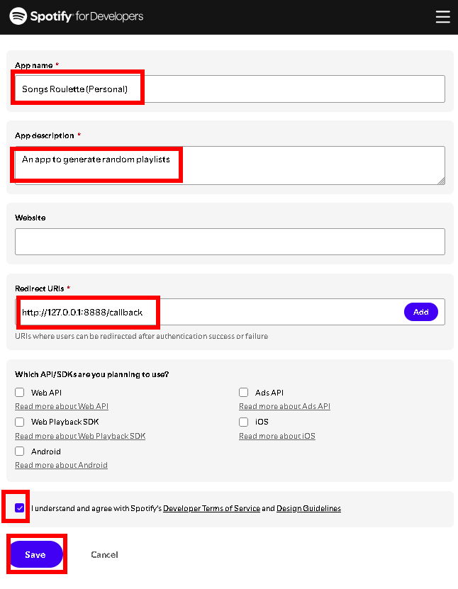
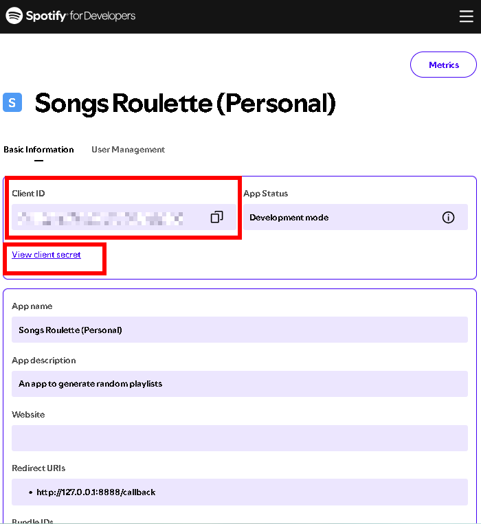
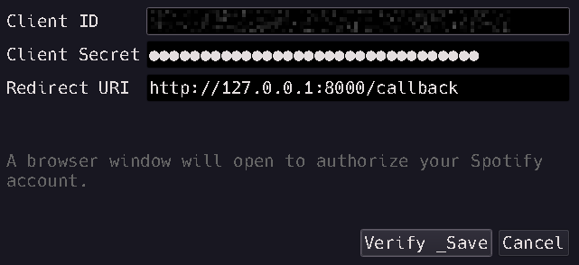

# Songs Roullete
Make truly random, bite-size playlists from your giant library—fast.
Tired of opening massive playlists on your phone only to wait… and then shuffle only surfaces your most recent adds? Songs Roulette builds a local database of your library (including Liked Songs) so you can spin off small, genuinely random playlists—perfect for discovery, travel, and fresh listening.

> Works on Windows (portable) and Linux (run the .py). UI in English / Español / 中文.

## Why Songs Roulette

- Big playlists = big lag
Opening huge lists on mobile can be slow. This app shifts the heavy lifting to your computer.

- Shuffle bias is real
Mobile shuffle often favors the latest additions. Songs Roulette samples from the entire set, fairly.

## What you get

- True randomness from any source playlist (including Liked Songs).

- Tiny, fresh playlists that supercharge Spotify’s phone recommendations (Enhance, Radio, etc.).

- Travel-ready selections—download a small, truly random set to your phone before going offline.

- Local JSON database (data.json) with all your playlists + tracks for fast re-use.

- Progress bars for DB updates and playlist creation.

- Nice UX: one click to update, one click to generate.

- Secure storage: credentials saved to an encrypted config.ini (Fernet with a local key.bin).

- Configurable API delay to play nice with rate limits.

- I18N: English / Español / 中文.

## Getting Spotify credentials

Getting Spotify credentials (one-time). You’ll do this once; after that the app remembers.

1. Log in with your Spotify account at https://developer.spotify.com/

2. Open the Spotify Developer Dashboard: https://developer.spotify.com/dashboard

3. Click “Create app”

Give it a name (e.g., Songs Roulette (Personal)).

Add a description.

Redirect URIs: http://127.0.0.1:8888/callback

(It must match exactly what you’ll enter in the app.)

5. Click Save. You'll see your Client ID, as well as a url to view your client secret.

6. Copy and paste your credentials in Songs Roulette:

Launch the app → Options → Credentials…

Paste Client ID, Client Secret, and the Redirect URI you added in step 4.

Click Verify & Save. Your browser opens—authorize the app.

7. Done. An encrypted config.ini and a key.bin will be created locally (keep them together).

> Privacy note: Your credentials are stored locally, encrypted with a key stored in key.bin. Delete both files to reset.

## Usage

### 1) Build your local database

Click "Update database".

Wait while Songs Roulette fetches all playlists and tracks (including Liked Songs).

Progress shows by total tracks. When done, you’ll see Database updated.

Output: data.json (you can reuse it across sessions).

### 2) Generate a random playlist

Random playlist generation:

Number of tracks → set how many you want (min 1).

Source playlist → pick any playlist (or Liked Songs).

Playlist name → optional; leave blank to auto-name RANDOM - YYYY-MM-DD HH:MM:SS.

Click Generate playlist.

Watch the progress bar as tracks are added.

Success message: Playlist created successfully.

Open Spotify → your new playlist is in your account.

## Great ways to use it

Travel: Create a small random mix and download it to your phone for offline listening.

Discovery: Make a 10-track random set from Liked Songs, then use the Spotify suggestion system to discover similar songs.

Deep cuts: Spin a random sampler from your old mega-playlist; you’ll surface tracks you forgot you loved.
